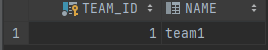
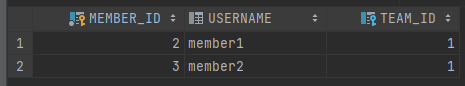

# Relationship Mapping

- 방향 (Direction) : 단방향과 양방향이 있다. 방향은 객체관계에만 존재하며, 테이블 관계는 항상 양방향이다.
- 다중성 (Multiplicity) : 다대일, 일대다, 일대일, 다대다. 매핑의 종류
- 연관관계의 주인 (Owner) : 연관관계의 주인만이 외래키를 관리하고, 데이터베이스에 매핑된다. 주인이 아닌 쪽은 읽기만 할 수 있다.

## 단방향 연관관계 (Unidirectional Manner)


### 객체 연관관계

- 회원 객체는 Member.team 필드로 팀 객체와 연관관계를 맺는다.
- 단방향 관계이기 때문에 팀에서는 회원을 알 수가 없다.
- 참조(주소)로 연관관계를 맺는다.

### 테이블 연관관계

- 회원 테이블에서는 TEAM_ID 외래키로 테이블과 연관관계를 맺는다.
- 테이블은 Join 을 이용하면 양 쪽 모두에서 조회할 수 있기 때문에 양방향 관계다.
- 외래 키로 연관관계를 맺는다.

```java

@Entity
public class Member {
    @Id
    @Column(name = "MEMBER_ID")
    @GeneratedValue
    private Long id;

    @ManyToOne
    @JoinColumn(name = "TEAM_ID")
    private Team team;
    
    ...
}
```

```java

@Entity
public class Team {

    @Id
    @Column(name = "TEAM_ID")
    @GeneratedValue
    private Long id;
    
    ...
}
```

객체의 연관관계에서 __Member.team__ 필드를 사용한다.

테이블의 연관관계에서는 __MEMBER.TEAM_ID__ 외래 키 컬럼을 사용한다.

- @ManyToOne : 다대일 (N:1) 매핑 어노테이션.
- @JoinColumn(name = "ColumnName") : 외래 키를 매핑할 때 사용한다. name 속성에 매핑할 외래 키 이름을 지정한다. 생략하는 경우 기본 전략을 사용한다.
    - 기본전략 : 필드명 + "_" + 참조하는 테이블의 컬럼명 ex) team _ TEAM_ID

## 연관관계 사용

### 저장

> JPA 에서 엔티티를 저장할 때 연관된 모든 엔티티는 영속 상태여야 한다.

```java
Team team=new Team("team1","팀1");
em.persist(team);

Member member1=new Member("member1","회원1");
member1.setTeam(team1);
em.persist(member1);

Member member2=new Member("member2","회원2");
member2.setTeam(team1);
em.persist(member2);
```

연관관계가 설정된 member 쪽의 team 필드를 설정한 후 영속상태로 만든다.

### 조회

2가지 방법이 있다

- 객체그래프 탐색 : member.getTeam() 을 이용하여 조회. 8장에서 설명
- 객체지향 쿼리 사용 : JPQL 을 사용하여 조회한다.

```java
String jpql="select m from Member m join m.team t "+
        "where t.name=:teamName";

        List<Member> resultList=em.createQuery(jpql,Member.class)
        .setParameter("teamName","팀1")
        .getResultList();

        for(Member member:resultList){
        member.getUsername();
        }
```

String 파라미터로 JPQL 을 넘긴다.

### 수정

update() 같은 메서드가 없으므로,

엔티티의 값만 변경해두면 트랜잭션을 커밋할 때 플러시가 일어나면서 변경 감지가 작동한다.

### 연관관계 제거

```java
Member member1=em.find(Member.class,member1.getId());
        member1.setTeam(null);
```

연관관계를 제거하기 위해서는 엔티티의 연관관계 필드를 null 로 해준다.

### 엔티티 삭제

```java
member1.setTeam(null);
        member2.setTeam(null);
        em.remove(team);
```

회원1 과 회원2 가 team 에 소속되어 있으면 제약조건으로 인해 삭제가 불가능하다.

연관관계를 모두 제거한 후 remove 메서드로 삭제한다.

## 양방향 연관관계


일대다 관계는 여러 건과 연관관계를 맺을 수 있으므로

Team.members 를 List 컬렉션으로 추가하여 양방향 연관관계를 구현한다.

데이터베이스 테이블은 외래 키 하나 그대로 변경되는 내용은 없다.

```java

@Entity
public class Team {

    @Id
    @Column(name = "TEAM_ID")
    @GeneratedValue
    private Long id;
    private String name;

    @OneToMany(mappedBy = "team")
    private List<Member> members = new ArrayList<>();
    
  ...
}
```

@OneToMany(mappedBy = "team")

- mappedBy 속성은 반대쪽 매핑의 필드 이름을 값으로 주면 된다. (Member.team)

```java
Team team=em.find(Team.class,team1.getId());
List<Member> members=team.getMembers();

for(Member member:members){
    System.out.println("member.getUsername() = "+member.getUsername());
}
```

find 로 조회하고 필드를 가져오면 List 컬렉션이 리턴된다.

## 연관관계의 주인

객체의 연관관계는 양방향이 아니라 단방향 두 개가 맺어진 것이다.

회원 -> 팀 , 팀 -> 회원

객체의 참조는 둘인데, 외래 키는 하나라 차이가 발생한다. 

- 연관관계의 주인 : 이런 차이로 JPA 에서 두 객체의 연관관계 중 하나를 정해서 외래 키를 관리한다. 


- 주인은 mappedBy 속성을 사용하지 않는다.
- 주인이 아니면 mappedBy 속성을 사용해서 연관관계의 주인을 지정해야 한다.

여기서 자기 테이블에 있는 외래 키를 관리할 수 있는 Member.team 이 주인으로 적합하다.

Team.members 를 지정하는 경우 전혀 다른 외래 키를 관리해야 한다.

> 연관관계의 주인만 데이터베이스 연관관계와 매핑되고 외래 키를 관리할 수 있다.
> 
> 주인이 아닌 반대편은 읽기만 가능하고 외래 키를 변경하지는 못한다.

> 일대다 관계에서는 다 쪽이 항상 외래 키를 가진다.


## 양방향 연관관계 저장

```java
Team team1 = new Team("team1");
em.persist(team1);

Member member1 = new Member("member1");
member1.setTeam(team1);
em.persist(member1);

Member member2 = new Member("member2");
member2.setTeam(team1);
em.persist(member2);
```

팀1 과 멤버1, 2 엔티티를 생성하고 연관관계를 설정, 영속 후 트랜잭션을 커밋하면 데이터베이스에 다음과 같이 저장된다.




```java
Team team1 = new Team("team1");
em.persist(team1);

Member member1 = new Member("member1");
member1.setTeam(team1);
em.persist(member1);

Member member2 = new Member("member2");
member2.setTeam(team1);
em.persist(member2);
```

하지만 연관관계의 주인에 값을 입력하지 않고, 

주인이 아닌 곳에만 값을 입력하면 데이터베이스에 정상적으로 저장되지 않는다.

```java
Member member1 = new Member("member1");
em.persist(member1);

Member member2 = new Member("member2");
em.persist(member2);

Team team1 = new Team("team1");
team1.getMembers().add(member1);
team1.getMembers().add(member2);
em.persist(team1);
```


team_id 에 null 이 들어가있다.

### 순수한 객체까지 고려한 양방향 연관관계

> 객체 관점에서 양쪽 방향에 모두 값을 입력해주는 것이 안전하다.

```java
Team team1 = new Team("team1");
em.persist(team1);

Member member1 = new Member("member1");
member1.setTeam(team1);
team1.getMembers().add(member1);
em.persist(member1);

Member member2 = new Member("member2");
member2.setTeam(team1);
team1.getMembers().add(member2);
em.persist(member2);
```

team 은 연관관계의 주인이 아니므로 

members List 에 추가하는 것은 데이터베이스에 저장 시 사용되지 않는다.

### 편의 메서드

```java
public void setTeam(Team team) {
    this.team = team;
    team.getMembers().add(this);
}
```
이와같이 setTeam 메서드 하나로 양방향 관계를 모두 설정하도록 변경한다.

### 주의사항

이 메서드는 연관관계를 추가만 할 뿐 기존의 연관관계를 삭제하지 않는다.

따라서 삭제하는 코드를 추가해야 한다.

```java
public void setTeam(Team team){
    if(this.team!=null){
        this.team.getMembers().remove(this);
    }
    this.team=team;
    team.getMembers().add(this);
}
```

삭제하는 코드를 추가하지 않으면, 영속성 컨텍스트가 살아있는 상태에서 team.getMembers() 를 호출하면
제거되지 않은 member 가 반환되는 문제가 발생한다.
