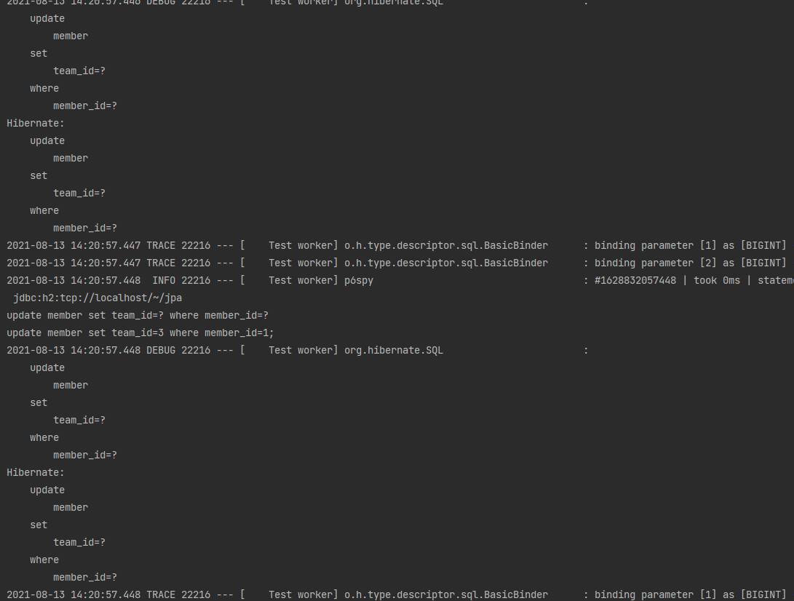

# 다양한 연관관계 매핑

### 다대일 단방향 (N : 1)


```java
@Entity
public class Member {
    @Id
    @Column(name = "MEMBER_ID")
    @GeneratedValue
    private Long id;

    @ManyToOne
    @JoinColumn(name = "TEAM_ID")
    private Team team;
}
```
```java
@Entity
public class Team {

    @Id
    @Column(name = "TEAM_ID")
    @GeneratedValue
    private Long id;
    private String name;
}
```

Member 쪽에만 참조하는 필드가 있고, Team 은 참조하는 필드가 없다.

@JoinColumn(name = "TEAM_ID") 를 사용해서 Member.team 필드를 TEAM_ID 왜래 키와 매핑했다.

연관관계의 주인으로, MEMBER 테이블의 TEAM_ID 외래 키를 관리한다.

### 다대일 양방향 (N:1 + 1:N)


```java
@Entity
public class Member {
    @Id
    @Column(name = "MEMBER_ID")
    @GeneratedValue
    private Long id;

    @ManyToOne
    @JoinColumn(name = "TEAM_ID")
    private Team team;
}
```
```java
@Entity
public class Team {

    @Id
    @Column(name = "TEAM_ID")
    @GeneratedValue
    private Long id;
    private String name;

    @OneToMany(mappedBy = "team")
    private List<Member> members = new ArrayList<>();
}
```

Member 와 Team 모두 참조하는 필드를 만든다.

다대일에서 일 쪽인 Team 에서는 List 컬렉션으로 멤버 필드를 관리한다.

> 양방향은 외래 키가 있는 쪽이 연관관계의 주인이다
>  - 다대일 에서는 항상 다(N) 에 외래 키가 있다. 일 쪽에서는 mappedBy 속성으로 연관관계의 주인을 설정한다.

> 양방향 연관관계는 항상 서로를 참조해야 한다.
> - 어느 한 쪽만 참조하면 양방향 연관관계가 성립하지 않는다. 편의 메서드를 양쪽에 모두 작성하면 무한루프에 빠질 수 있으므로 이것도 검사해야 한다.
    
### 일대다 (1:N)


```java
@Entity
public class Team {

    @Id
    @Column(name = "TEAM_ID")
    @GeneratedValue
    private Long id;
    private String name;

    @OneToMany
    @JoinColumn(name = "TEAM_ID")
    private List<Member> members = new ArrayList<>();
}
```
```java
@Entity
public class Member {
    @Id
    @Column(name = "MEMBER_ID")
    @GeneratedValue
    private Long id;
    
    private String username;
}
```

일대다 관계에서 외래 키는 항상 다쪽 테이블에 있다.

여기서 다 쪽의 Member 엔티티에는 외래키를 매핑할 수 있는 참조 필드가 없다.

Team 엔티티에만 참조 필드인 members 가 있다. 반대편 테이블의 외래 키를 관리하게 된다.

일대다 단방향 관계를 매핑할 때는 @JoinColumn 을 명시해서 매핑해야 한다.

#### 단점

매핑한 객체가 관리하는 외래 키가 다른 테이블에 있다.

따라서 엔티티의 저장과 수정에서 연관관계 처리를 위한 UPDATE SQL 을 추가로 실행해야 한다.



Member 엔티티는 Team 엔티티를 모르기 때문에 Member 엔티티를 저장할 때는 MEMBER 테이블의 TEAM_ID 에 아무 값도 저장되지 않는다.

Team 엔티티를 저장할 때 Team.members 의 참조를 확인해서 회원 테이블에 있는 TEAM_ID 외래 키를 업데이트 하게 된다.

### 일대다 양방향 (1:N + N:1)


다대일 관계는 항상 다 쪽에 외래 키가 있다. 

따라서 @ManyToOne 에는 mappedBy 속성이 없어서 @JoinColumn 을 이용해 읽기전용 필드를 만든다.

```java
@Entity
public class Team {

    @Id
    @Column(name = "TEAM_ID")
    @GeneratedValue
    private Long id;
    private String name;

    @OneToMany
    @JoinColumn(name = "TEAM_ID")
    private List<Member> members = new ArrayList<>();
}
```
```java
@Entity
public class Member {
    @Id
    @Column(name = "MEMBER_ID")
    @GeneratedValue
    private Long id;

    @ManyToOne
    @JoinColumn(name = "TEAM_ID", insertable = false,
        updatable = false)
    private Team team;
}
```

둘 다 같은 키를 관리하므로 문제가 발생할 수 있기 때문에, 다대일 쪽은 insertable, updatable 속성을 false 로 설정해서
읽기전용으로 만든다.

일대다 양방향보단 일대다 단방향 + 다대일 단방향(읽기전용) 이다.

따라서 일대다 단방향 매핑이 가지는 단점을 그대로 가지게 된다.

### 일대일 (1:1)

- 일대일 관계는 그 반대도 일대일 관계다.
- 테이블 관계에서 일대일은 어느 곳이나 외래 키를 가질 수 있다. 개발자가 선택해야 한다.

### 주 테이블에 외래 키 : 일대일 단방향


```java
@Entity
public class Member {
    
    @Id
    @Column(name = "MEMBER_ID")
    @GeneratedValue
    private Long id;

    @OneToOne
    @JoinColumn(name = "LOCKER_ID")
    private Locker locker;
}
```
```java
@Entity
public class Locker {
    
    @Id @GeneratedValue
    @Column(name = "LOCKER_ID")
    private Long id;
    
    private String name;
}
```

일대일이므로 @OneToOne 을 사용하여 매핑했고, 단방향이므로 반대쪽에 mappedBy 를 사용하지 않고

외래키를 가진 Member 에만 매핑을 했다.

### 주 테이블에 외래 키 : 일대일 양방향


```java
@Entity
public class Member {
    
    @Id
    @Column(name = "MEMBER_ID")
    @GeneratedValue
    private Long id;

    @OneToOne
    @JoinColumn(name = "LOCKER_ID")
    private Locker locker;
}
```
```java
@Entity
public class Locker {
    
    @Id @GeneratedValue
    @Column(name = "LOCKER_ID")
    private Long id;
    
    @OneToOne(mappedBy = "locker")
    private Member member;
    
    private String name;
}
```
위의 단방향에서 @OneToOne(mappedBy = "locker") 를 선언하여 연관관계를 설정하고, 연관관계의 주인이 아님을 설정한다.

### 대상 테이블에 외래 키 : 일대일 단방향


현재 JPA 에서는 일대일 매핑에서 대상 테이블에 외래 키가 있는 단방향 관계는 지원하지 않는다.

### 대상 테이블에 외래 키 : 일대일 양방향


```java
@Entity
public class Member {
    
    @Id
    @Column(name = "MEMBER_ID")
    @GeneratedValue
    private Long id;

    @OneToOne(mappedBy = "member")
    private Locker locker;
}
```
```java
@Entity
public class Locker {
    
    @Id @GeneratedValue
    @Column(name = "LOCKER_ID")
    private Long id;
    
    @OneToOne
    @JoinColumn(name = "MEMBER_ID")
    private Member member;
    
    private String name;
}
```
이전 주 테이블에 외래 키가 있는 양방향과 같다. 연관관계의 주인만 바꾸면 된다.

### 다대다 (N:N)

관계형 데이터베이스는 [정규화](https://velog.io/@wldus9503/%EB%8D%B0%EC%9D%B4%ED%84%B0%EB%B2%A0%EC%9D%B4%EC%8A%A4-%EC%A0%95%EA%B7%9C%ED%99%94Normalization%EB%9E%80) 된 테이블 2개로 다대다 관계를 표현할 수 없다.


연결 테이블을 추가하여 다대다 관계를 구현한다.

### 다대다 단방향

```java
@Entity
public class Member {
    @Id
    @Column(name = "MEMBER_ID")
    @GeneratedValue
    private Long id;

    @ManyToMany
    @JoinTable(name = "MEMBER_PRODUCT",
            joinColumns = @JoinColumn(name = "MEMBER_ID"),
            inverseJoinColumns = @JoinColumn(name = "PRODUCT_ID"))
    private List<Product> products = new ArrayList<>();
}
```
```java
@Entity
public class Product {
    
    @Id @GeneratedValue
    @Column(name = "PRODUCT_ID")
    private Long id;
    
    private String name;
}
```

Member 와 Product 를 @ManyToMany 로 매핑한다.

여기서 @JoinTable 을 사용하여 연결 테이블을 바로 매핑했다.

- @JoinTable.name : 연결 테이블을 지정한다.
- @JoinTable.joinColumns : Member 와 매핑할 조인 컬럼 정보를 지정한다.
- @JoinTable.inverseJoinColumns : 반대 방향인 Product 와 매핑할 조인 컬럼 정보를 지정한다.

```java
Product productA = new Product();
productA.setName("상품A");
em.persist(productA);

Member member1 = new Member();
member1.setUsername("회원1");
member1.getProducts().add(productA);
em.persist(member1);
```
실행하면 Product, Member, Member_Product 테이블에 각각 인서트 되는 것을 확인할 수 있다.

### 다대다 양방향

```java
@Entity
public class Product {
    
    @Id @GeneratedValue
    @Column(name = "PRODUCT_ID")
    private Long id;
    
    @ManyToMany(mappedBy = "products")
    private List<Member> members;
    
    private String name;
}
```

Product 엔티티에 @ManyToMany(mappedBy ) 를 추가하면 다대다 양방향 관계가 된다.

여기서 Member 에 편의 메서드를 추가한다.

```java
public void addProduct(Product product) {
    ...
    products.add(product);
    product.getMembers().add(this);
}
```

### 다대다 매핑의 한계

@ManyToMany 를 사용하면 연결 테이블에 다양한 정보를 담을 수가 없다.

위의 Member_Product 테이블에는 오직 Member 와 Product 의 키값만 담긴다.


orderAmount 와 orderDate 컬럼을 추가하면 다대다 매핑에서는 추가한 컬럼들을 매핑할 수 없기 때문에
@ManyToMany 를 사용할 수 없다.

결과적으로 양 쪽의 관계를 일대다, 다대일 관계로 풀어야 한다.

```java
@Entity
public class Member {
    @Id
    @Column(name = "MEMBER_ID")
    @GeneratedValue
    private Long id;

    @OneToMany(mappedBy = "member")
    private List<MemberProduct> memberProducts = new ArrayList<>();
}
```

회원 상품 엔티티쪽이 연관관계의 주인이므로 Member 쪽에 mappedBy 를 사용한다.

```java
@Entity
@IdClass(MemberProductId.class)
public class MemberProduct {

    @Id
    @ManyToOne
    @JoinColumn(name = "MEMBER_ID")
    private Member member;

    @Id
    @ManyToOne
    @JoinColumn(name = "PRODUCT_ID")
    private Product product;

    private int orderAmount;

    private LocalDateTime dateTime;
}
```

```java
public class MemberProductId implements Serializable {
    private Long member;
    private Long product;

    @Override
    public boolean equals(Object o) {
        if (this == o) return true;
        if (o == null || getClass() != o.getClass()) return false;
        MemberProductId that = (MemberProductId) o;
        return Objects.equals(member, that.member) && Objects.equals(product, that.product);
    }

    @Override
    public int hashCode() {
        return Objects.hash(member, product);
    }
}
```

회원 상품 엔티티는 @IdClass 를 사용해서 복합 기본 키를 매핑했다.

#### 복합 기본 키

- 복합 키는 별도의 식별자 클래스를 만들어야 한다.
- equals 와 hashCode 메서드를 구현해야 한다.
- 기본 생성자가 있어야 한다.
- 식별자 클래스는 public 이어야 한다.
- @IdClass 이외에 @EmbeddedId 를 사용할 수도 있다.

#### 식별 관계
> 부모 테이블의 기본 키를 받아서 자신의 기본 키 + 외래 키로 사용하는 것

```java
Member member1 = new Member();
member1.setUsername("회원1");
em.persist(member1);

Product productA = new Product();
productA.setName("상품1");
em.persist(productA);

MemberProduct memberProduct = new MemberProduct();
memberProduct.setMember(member1);
memberProduct.setProduct(productA);
memberProduct.setOrderAmount(2);
memberProduct.setDateTime(LocalDateTime.now());
em.persist(memberProduct);
```

실행하면 Member, Product, Member_Product 에 각각 인서트된다.

### 다대다 : 새로운 기본 키 사용


Member 와 Product 사이에 Order 라는 엔티티를 새로 만들고, 기본 키를 따로 만들어 사용하면서
Member 와 Product 의 컬럼은 외래 키로만 사용한다.

```java
@Entity
public class Order {

    @Id @GeneratedValue
    @Column(name = "ORDER_ID")
    private Long id;

    @ManyToOne
    @JoinColumn(name = "MEMBER_ID")
    private Member member;

    @ManyToOne
    @JoinColumn(name = "PRODUCT_ID")
    private Product product;

    private int orderAmount;
}
```

```java
@Entity
public class Member {
    @Id
    @Column(name = "MEMBER_ID")
    @GeneratedValue
    private Long id;

    @OneToMany(mappedBy = "member")
    private List<Order> orders = new ArrayList<>();
}
```

Member 에 있던 MemberProduct 매핑을 Order 로 바꾸기만 하면 된다.